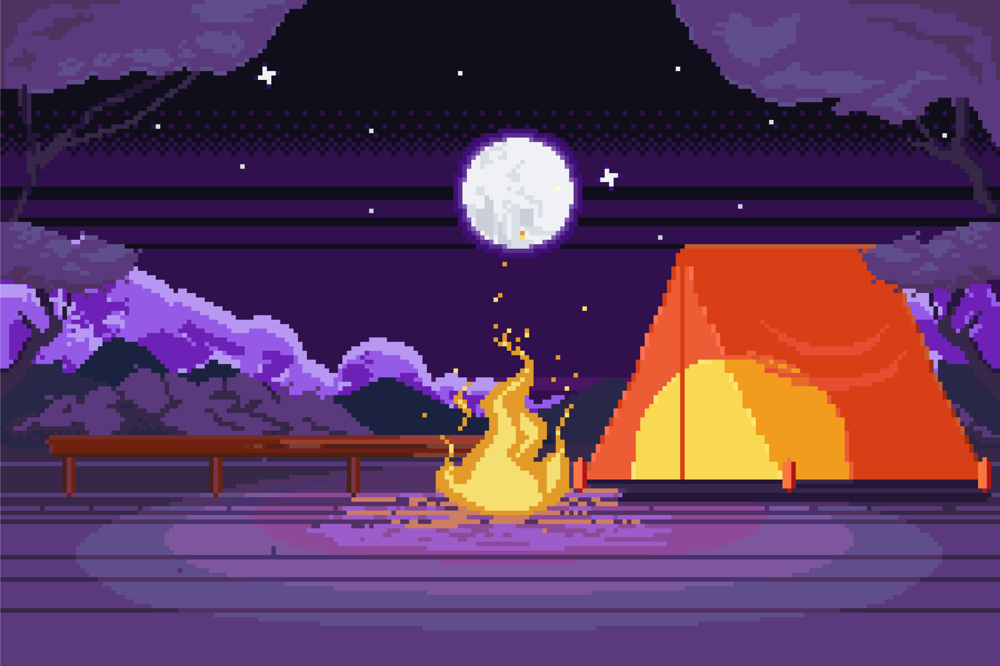

<!-- PIXEL CAMPFIRE HEADER -->
<div align="center">

```
 ░░░░░░░░░░░░░░░░░░░░░░░░░░░░░░░░░░░░░░░░░░░░░░░░░░░░░░░░░░░░░░░░░░░░░
 ░  ★          ·      ✦       ·           ★        ·      ✦      ·  ░
 ░       ·          ★    ·         ✦           ·       ★           ░
 ░   ✦        ·               ·       ★   ·        ✦       ·       ░
 ░         ★       ·    ✦          ·          ★         ·          ░
 ░░░░░░░░░░░░░░░░░░░░░░░░░░░░░░░░░░░░░░░░░░░░░░░░░░░░░░░░░░░░░░░░░░░░░
```


</div>

---

<!-- ABOUT ME: GAME STATS STYLE -->
<div align="center">

## 🔥  PLAYER STATS  🔥

</div>

```
╔══════════════════════════════════════════════════════════════╗
║  ▓▓▓▓▓▓▓▓▓▓▓▓▓▓▓▓▓▓▓▓▓▓▓▓▓▓▓▓▓▓▓▓▓▓▓▓▓▓▓▓▓▓▓▓▓▓▓▓▓▓▓▓▓▓▓     ║
║                                                              ║
║   NAME     :  NURISLAM                ★ LVL 99              ║
║   CLASS    :  AI ENGINEER                                    ║
║   LOCATION :  Digital Realm 🌌                               ║
║   STATUS   :  [ ████████████████░░░░ ] Building in public    ║
║   EXP      :  ∞ Lines of code written                        ║
║   GUILD    :  Open Source Adventurers                        ║
║                                                              ║
║  ▓▓▓▓▓▓▓▓▓▓▓▓▓▓▓▓▓▓▓▓▓▓▓▓▓▓▓▓▓▓▓▓▓▓▓▓▓▓▓▓▓▓▓▓▓▓▓▓▓▓▓▓▓▓▓  ║
╚══════════════════════════════════════════════════════════════╝
```

---

<!-- SKILLS: INVENTORY STYLE -->
<div align="center">

## 🎒  INVENTORY — TECH SKILLS 

</div>

```
┌─────────────────────────────────────────────────────────────┐
│                   ⚔️  WEAPONS & TOOLS ⚔️                   │
│                                                             │
│  [LEGENDARY]  🟠 Python        🟠 TypeScript               │
│  [EPIC]       🟣 React         🟣 Node.js                  │
│  [RARE]       🔵 PostgreSQL    🔵 Docker                   │
│  [UNCOMMON]   🟢 Redis         🟢 GraphQL                  │
│  [COMMON]     ⚪ Git           ⚪ Linux                    │
│                                                             │
└─────────────────────────────────────────────────────────────┘
```

<div align="center">


</div>

---

<!-- GITHUB STATS -->
<div align="center">

## 📊  QUEST LOG — GITHUB STATS 


</div>

<div align="center">

</div>

---

<!-- PROJECTS: QUEST BOARD -->
<div align="center">

## 🗺️  ACTIVE QUESTS — PROJECTS 

</div>

```
┌───────────────────────────────────────────────────────────────────────────────┐
│  📜 QUEST BOARD                                                               │
│                                                                               │
│  ⚔️  [MAIN QUEST]   Putting everything into digital    ████████████░░  90%    |
│  🏹  [SIDE QUEST]   Project Beta                       ██████░░░░░░░░  45%    │
│  🔮  [HIDDEN]       Secret Project                     ██░░░░░░░░░░░░  15%    │
│  🌟  [COMPLETED]    Awesome Library                    ██████████████  100% ✓│
│                                                                               │
└───────────────────────────────────────────────────────────────────────────────┘
```

| 🏆 Quest | 📖 Description | ⚡ Tech | 🌟 Stars |
|---|---|---|---|
| [**Project Alpha**](https://github.com/YOUR_USERNAME/project) | The legendary artifact | React, Node |  |
| [**Project Beta**](https://github.com/YOUR_USERNAME/project2) | The enchanted scroll | Python, FastAPI |  |

---

<!-- CONTRIBUTION GRAPH -->
<div align="center">

## 🌄  WORLD MAP — CONTRIBUTIONS 


</div>

---

<!-- CAMPFIRE SECTION -->
<div align="center">

## 🔥  CAMPFIRE — FIND ME HERE 

*Come sit by the fire, fellow adventurer...*


[](https://twitter.com/YOUR_HANDLE)
[](https://linkedin.com/in/YOUR_PROFILE)
[](https://YOUR_WEBSITE.com)
[](mailto:your@email.com)

</div>

---

<!-- FOOTER -->
<div align="center">

```
╔══════════════════════════════════════════════════════════╗
║                                                          ║
║    THANKS FOR VISITING, ADVENTURER!                      ║
║    May your code be bug-free and your commits clean. 🔥  ║
║                                                          ║
║    [ PRESS START TO COLLABORATE ]                        ║
║                                                          ║
╚══════════════════════════════════════════════════════════╝
```


</div>
